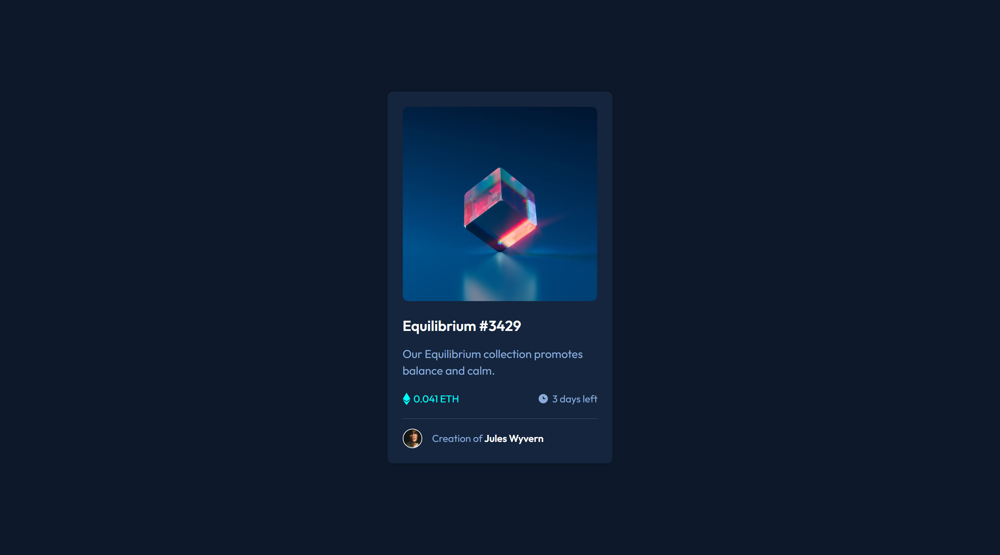
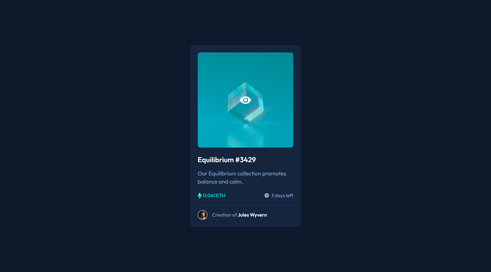
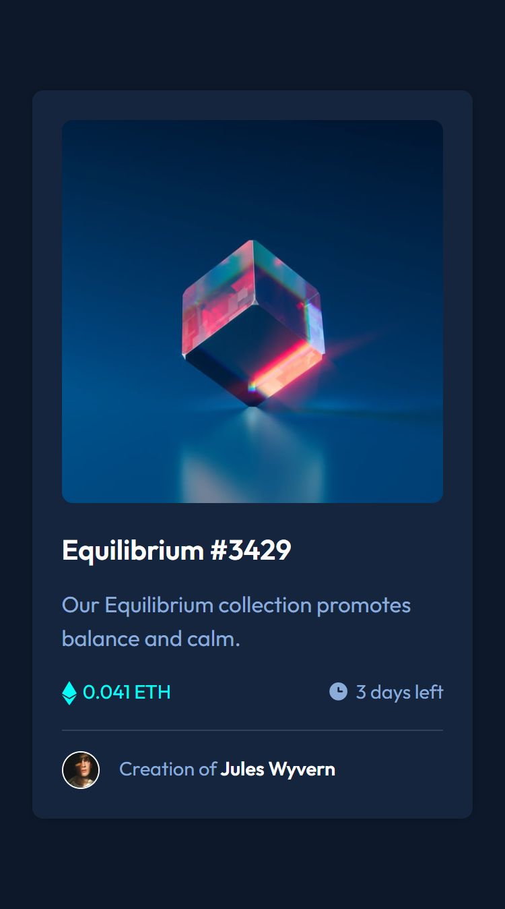

# Frontend Mentor - NFT preview card component

## Welcome! 👋

This is a solution to the **NFT preview card component challenge**.

For this challenge I use **HTML** and **CSS**.

The most difficult part of the challenge was to create the overlay for the image at the beginning, the only drawback is that if you hover the mouse over the view icon the color disappears. Other than that I am happy with the result as I tried not to search on youtube and just go by the documentation.

## Screenshots 🤨📷

### 1440px Desktop 

### Overlay

### 375px Mobile

